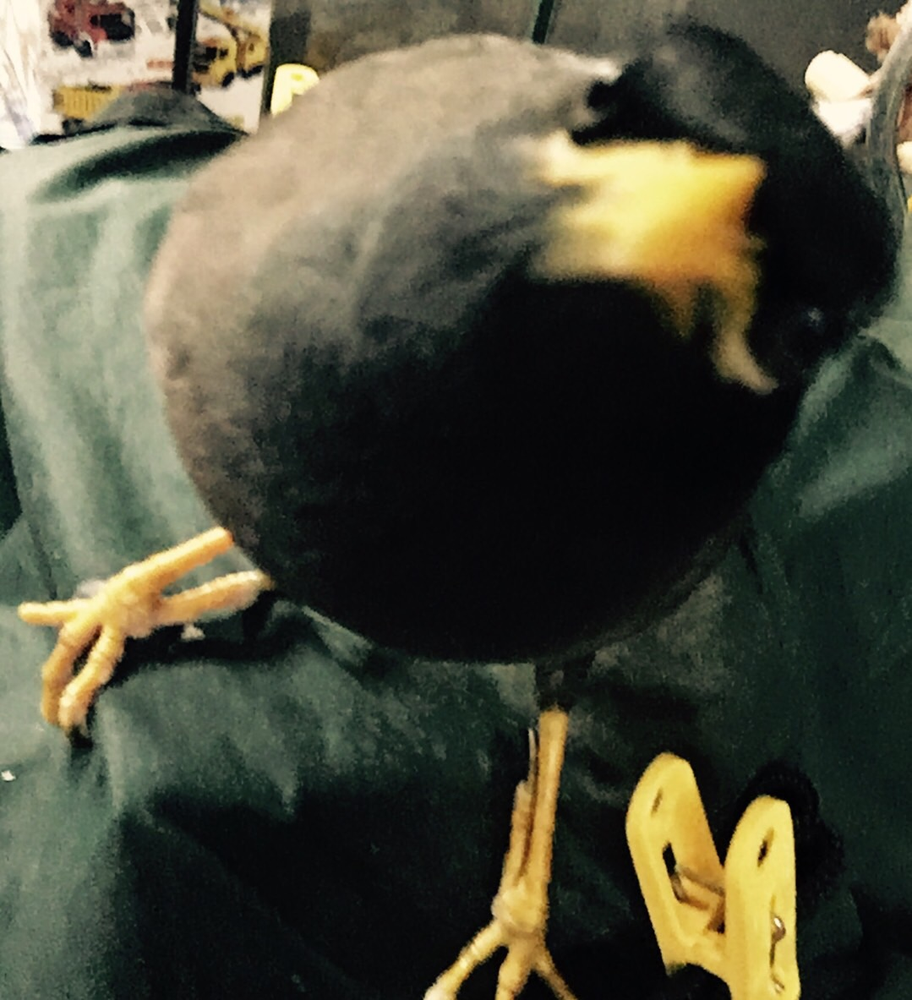

<p align="center">
  
</p>

# vue_program

> A Vue.js project

## 开发流程

``` bash
# 安装依赖
npm install

# serve with hot reload at localhost:8080
npm run dev

# build for production with minification
npm run build

# build for production and view the bundle analyzer report
npm run build --report

# run unit tests
npm run unit

# run e2e tests
npm run e2e

# run all tests
npm test
```

## 目录结构
```shell
├── build                      // 构建相关  
├── config                     // 配置相关
├── src                        // 源代码
│   ├── api                    // 所有请求
│   ├── assets                 // 主题 图片等静态资源
│   ├── components             // 全局公用组件
│   ├── directive              // 全局指令
│   ├── filtres                // 全局 filter
│   ├── icons                  // 项目svg icons
│   ├── lang                   // 国际化 lang
│   ├── mock                   // 项目mock 模拟数据
│   ├── router                 // 路由
│   ├── store                  // 全局 store
│   ├── styles                 // 全局样式
│   ├── utils                  // 全局公用方法
│   ├── vendor                 // 公用vendor
│   ├── views                  // views
│   ├── App.vue                // 入口页面
│   ├── main.js                // 入口js 初始化 加载组件等
│   └── permission.js          // 权限管理
├── static                     // 第三方不打包资源
│   └── Tinymce                // 富文本
├── .babelrc                   // babel-loader 配置
├── .eslintrc.js               // eslint 配置项
├── .postcssrc.js              // postcss 配置项
├── .gitignore                 // git 忽略项
├── favicon.ico                // favicon图标
├── index.html                 // html模板
└── package.json               // package.json

```


For a detailed explanation on how things work, check out the [guide](http://vuejs-templates.github.io/webpack/) and [docs for vue-loader](http://vuejs.github.io/vue-loader).
